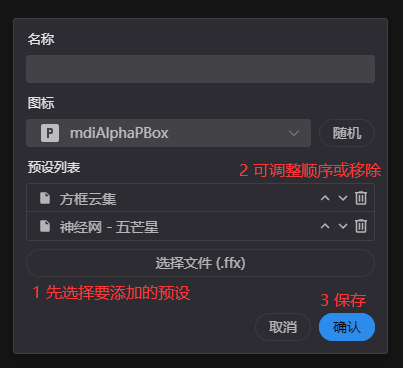

# openbar 使用文档

## 安装(windows)
- 解压压缩包文件到`C:\Program Files (x86)\Common Files\Adobe\CEP\extensions`

  

- 注册表在`\HKEY_CURRENT_USER\Software\Adobe\CSXS.11`（没有则创建）中新建一个字符串值，名称为`PlayerDebugMode`，值为`1`

  

- 在Ae首选项`脚本和表达式`中启用`允许脚本写入文件和访问网络`

## 安装(macOS)
- 解压压缩包文件到`/Library/Application Support/Adobe/CEP/extensions`
- 在终端中输入`defaults write com.adobe.CSXS.11 PlayerDebugMode 1`
- 在Ae首选项`脚本和表达式`中启用`允许脚本写入文件和访问网络`

## 数据安全
- 本扩展不保证完全没有bug会导致项目数据丢失甚至损坏，请务必打开Ae的自动保存功能并经常手动备份重要的工程
- openbar的（效果/预设/表达式）操作均支持撤销
- openbar的数据保存在`用户目录/.openbar`中，建议偶尔备份以防误删面板或按钮数据
- 使用命令行按钮功能时，请确保命令的安全性，不要执行自己不了解的命令

## 主界面(openbar)
打开方式：Ae菜单栏->窗口->扩展->openbar
- 打开设置：在Ae的面板菜单中，点击`设置`打开设置界面
- 面板切换：右键空白区域打开菜单进行切换
- 按钮
    - 效果按钮：将多个效果应用到多个图层
    - 预设按钮：将多个预设文件应用到多个图层
    - 表达式按钮：将保存的表达式应用到多个属性上（不检查合法性）
    - 菜单项按钮：执行所选的Ae菜单栏里的功能
    - 命令行按钮：执行系统命令行语句

  

## 设置界面(openbar settings)

设置界面最多约占用300M左右内存，设置完成后建议关闭

### 按钮管理

#### 节点
- 节点支持拖拽操作，可对按钮排序或移动到另一个面板

    #### 面板节点
    - 新建面板：创建新的面板
    - 创建按钮：在当前面板创建不同类型的按钮
    - 编辑：修改面板名称
    - 可见：切换面板可见性（是否显示在主界面右键菜单上）
    - 删除：删除当前面板（默认面板不可删除）

    #### 按钮节点
    - 编辑：修改按钮数据
    - 可见：切换按钮可见性（是否显示在主界面上）
    - 删除：删除当前按钮

  

#### 表单
- 图标：图标库为[Material Design Icons](https://pictogrammers.com/library/mdi/)，可根据图标名称搜索
- 随机：随机选择一个图标！
- 确认：创建或更新按钮时，数据会实时同步到主界面

    #### 效果按钮
    - 效果列表：要对图层应用的效果，顺序为从上到下，支持调整顺序和移除
    - 选择：在下拉框中选择要添加到列表的效果（支持搜索），点击`添加`添加到列表中
    - 从图层获取：先在Ae中选中图层的若干效果，点击`添加当前选择的效果`将其添加到列表中
    - 确认：若此时为创建模式且启用自动命名且名称为空，自动使用第一个效果的名称作为按钮名称
    

      
    

    #### 预设按钮
    - 预设列表：要对图层应用的预设列表，顺序为从上到下，支持调整顺序和移除
    - 选择文件：选择要添加到列表的预设，支持多选
    - 确认：若此时为创建模式且启用自动命名且名称为空，自动使用第一个预设的名称作为按钮名称
    

      
    

        
    #### 表达式按钮
    - 表达式：vscode同款编辑框，已启用js语法高亮
    

      
    

    #### 菜单项按钮
    - 选择：从级联选择中选择菜单项。结构与Ae上方的菜单栏相同，但缺少部分不支持的菜单项
    - 输入id：如果你有菜单id（`menuCommandId`），可以直接使用
    

      
    

    #### 命令行按钮
    - 命令行：已启用shell语法高亮
    

      
    

### 全局设置
界面的功能比较简单不再赘述

#### 按钮形状
- 圆形按钮需要仅显示图标或仅显示文本+显示前1个字/显示前2个字才可正常显示

#### 关于
- 点击版本号旁边的按钮进行更新检查
- 下载新版本后直接全量覆盖即可，不影响用户数据

## 使用问题

- 主界面只有一个reload按钮
    - 首次加载扩展可能会出现此问题，点击按钮即可
    - 如果点击按钮后仍然只有reload按钮，说明扩展加载失败，参考[错误报告](#错误报告)

- 效果列表不显示
    - 确保windows用户目录路径不含中文（实际上很多插件或扩展在包含中文的目录下都不能正常工作）
        - 知乎有修改用户目录名称的教程
        - 怕丢数据建议重新创建一个用户使用
    - 尝试通过右键使用管理员权限打开Ae

## 错误报告
如果使用过程中出现问题，可通过浏览器打开`localhost:8860`->`Openbar`->`Console`查看错误日志，复制或截图发送到issue或邮箱